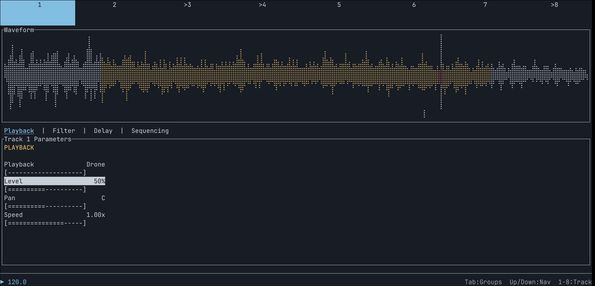

# ceremony - glitch sampler/idea generator

ceremony is a sampler, but it's not really a sampler you have a whole lot of control over. you give it a sample, but you don't fully control what parts of it play, or when. if you like the glitchy sounds of late 90s, early 00s electronic music and you're fine with taking your hands off the wheel, this might be for you.

## features

* eight tracks, all based on one sample
* each track has the following:
    * playback modes:
        * drone: continual looping of the sample segment
        * sequence: retrigger the sample segment based on a perlin noise grid
    * volume
    * pan
    * playback speed: -2x to 2x
    * filter: lowpass, highpass, bandpass
    * overdrive
    * bitcrushing
    * sample rate reduction
    * per-track delay
    * per-track reverb
    * vague control of the perlin noise sequencer
    * four modulators, each of which can modulate any number of parameters
* project-wide bpm and swing
* 12 scenes - save states for parameters that you can instantly switch between
* save and load projects
* render output as wav

here's a hastily made video showing some of ceremony's features:

## how to use

run the executable. you can either run it without arguments, or give it either a wav file or ceremony project file. if you've given it a file, it will begin playing immediately. if not, open a file using ctrl+o. when you open a file, each track will be given a random segment of the sample. the following things are randomized on file load per track:

* segment start
* segment length
* playback mode
* beat division, in sequence mode

if you don't like how it sounds, try hitting shift+enter. this will re-randomize all tracks. if you just want to randomize the one you're on, press enter.

explore! pressing tab while on the track screen takes you through all the parameters for the track. pressing the number keys will switch tracks. there are other screens as well:
* pressing m takes you to the modulator screen. this is where you can change the parameters for the per-track modulators
* pressing x takes you to the mixer, where you can view and modify levels, panning, mutes and solos
* pressing p takes you to the project screen, where you can save and load projects as well as modify bpm and swing

the [project wiki](https://github.com/seawaffle/ceremony/wiki) has more information on what is available, keypresses, etc

## inspirations

nothing exists in a vacuum. here are some of the things that inspired this idea:

* musically, this is inspired by the sound of turn of the century electronic music, particularly the glitchy stuff coming out of labels like mille plateaux or raster-noton
* technically:
    * ceremony is heavily inspired by the [eterna script on norns](https://github.com/etsuko-fm/eterna). i don't have a functioning norns, but when i saw eterna, it filled me with a need to make something. the random chunks and perlin noise sequencing are all directly from here.
    * drone mode for tracks is inspired by [quartet](https://maxforlive.com/library/device/14065/quartet). seeing both eterna and quartet really solidified what i wanted to make.
    * i had thought about making a rust terminal-based music app for a long time, and [dronage](https://boorch.itch.io/dronage-terminal) really lit a fire under me when it came out. seeing that made me realize it was attainable.
    * the modulators are inspired by the [torso s-4](https://torsoelectronics.com/products/s-4). at one point i was working on a terminal-based remake of the s-4, and that modulator work basically went directly into this
    * it may not feel obvious, but the parameter editing is somewhat inspired by [lsdj](https://www.littlesounddj.com/lsd/index.php)/[dirtywave m8](https://dirtywave.com/). i definitely feel it's one of the more elegant ways to edit when trying to work with limited controls.

## questions

### am i going to be able to make a hit song with this?

probably not. but maybe it'll give you some ideas to add to your song!

### what sort of sample should i use?

i've found that something melodic and not too dense works best. also, i like the sample to be 30 seconds or less, because the length of the sample segments are based on the total length of the sample. if you pick a very long sample, the segments will also be longer, and that means a lot more overlapping sounds. but it's entirely up to you how you use it.

### is this complete?

not at all. things may get added or removed at any point. i feel like i have the basics of this down, but there's still a lot of room for improvement.

### why isn't this open source?

it will be eventually. right now, the code is not anywhere near what i'd like other people to be seeing. i'd hate to put this out and have someone learning how to do things see it and think 'this is the right way to do things'. it's a mess. i have only used crates with permissive licenses (as far as i and `cargo deny` can tell at least), so it's not imperative to open source right now. also, it's still sort of my baby and i don't know that i'm ready to fully give up control yet. rest assured that it will eventually be open sourced.

### was ai used in making this?

a little. i am very new to audio programming, and it's a tough field. i've been using claude to help out with some of the things i don't fully understand, primarily dsp and timing related things. i just know that if i waited until i fully understood everything i needed before getting something workable, i would probably lose interest. if this makes you not want to use this, no worries, i respect your ideals.

## technologies used

ceremony is written in rust, and uses the following crates:

* cpal
* fundsp
* audio_thread_priority
* ratatui
* crossterm
* ratatui-explorer
* ringbuf
* log
* env_logger
* ctrlc
* atomic_float
* arc-swap
* wide
* hound
* rubato
* rand
* noise
* biquad
* serde
* postcard
* anyhow
* time
* sysinfo
